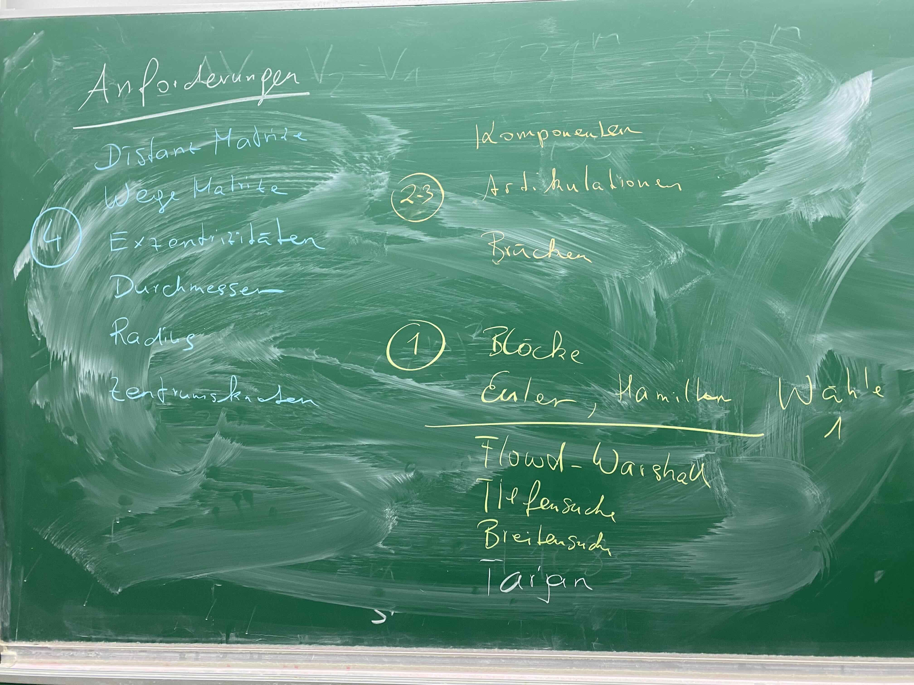

#schule #code
# Using go
Rust is too complicated to learn in this short amount of time

# Initialize the project
To create the project
- Create a directory
- Go inside
- Run `go mod init projectname`

To run the program
`go run .`

# The graph program

## Reading the file and parsing the csv
Reading the file is easy
Converting the csv to a 2d slice was easy as well
- But the resulting slice is a string slice
- In order to convert this to integers 
	- Using a nested for loop
	- Iterate over every item
	- Parse it
	- And write it to the same index in an integer slice

